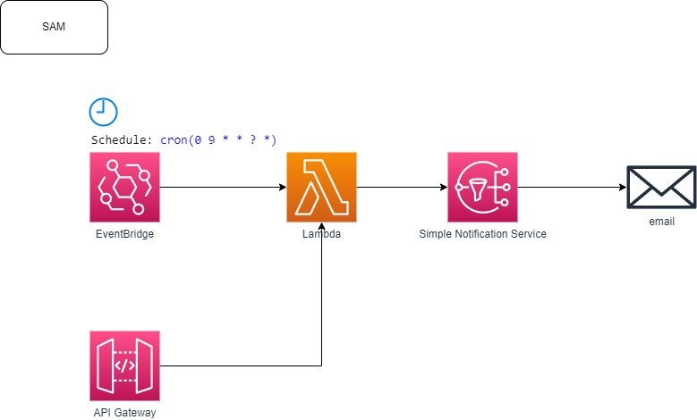

# aws-cost-explorer-api

lambda(python)で作成した AWS Cost Explorer API のサンプルです。



以下を利用

- boto3.client('ce').get_cost_and_usage
- boto3.client('sns').publish

## env

```
$ python -VV
Python 3.13.1 (main, Jan  7 2025, 14:39:30) [GCC 9.4.0]
```

sam を利用して作成

```
sam init \
  --name aws-cost-report \
  --package-type Image \
  --base-image amazon/python3.13-base \
  --app-template hello-world-lambda-image \
  --no-application-insights \
  --no-tracing
```

```
$ tree -L 2
.
├── README.md
├── __init__.py
├── events
│   └── event.json
├── hello_world
│   ├── Dockerfile
│   ├── __init__.py
│   ├── app.py
│   └── requirements.txt
├── samconfig.toml
├── template.yaml
└── tests
    ├── __init__.py
    └── unit
```

## local 実行

```bash
sam build & sam local start-api
```

## deploy 実行

```bash
sam build & sam deploy
```

## delete

```
sam delete
```
